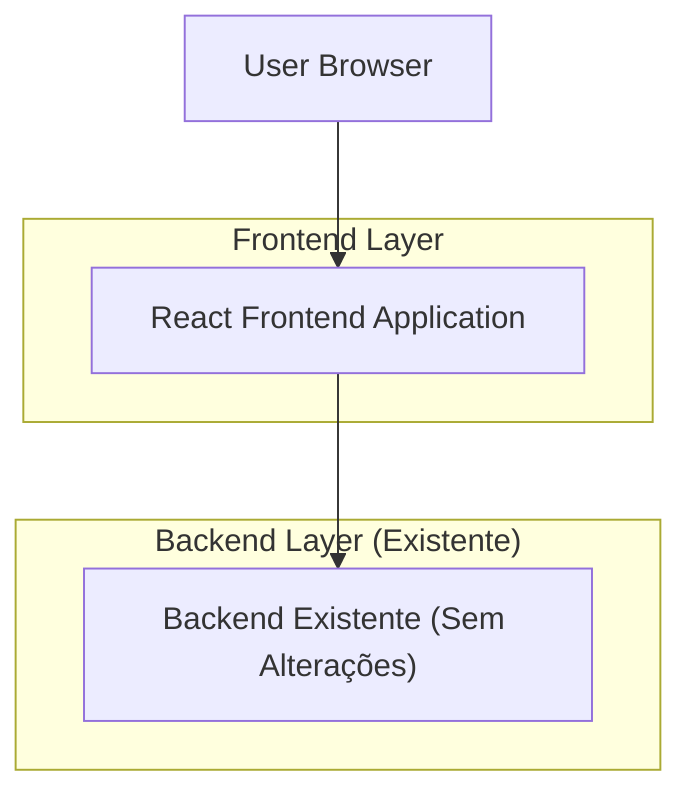

## 1.Architecture design

## 2.Technology Description
- Frontend: React@18 + TypeScript + CSS responsivo (Flexbox/Grid)
- Backend: Existente (inalterado)

## 3.Route definitions
| Route | Purpose |
|-------|---------|
| / | Shell da aplicação; aplica regras anti-overflow e decide navegação (mobile vs desktop). |
| /?tab=1 | Abre a Aba 1 da bottom navigation (deep link opcional). |
| /?tab=2 | Abre a Aba 2 da bottom navigation (deep link opcional). |
| /?tab=3 | Abre a Aba 3 da bottom navigation (deep link opcional). |
| /?tab=4 | Abre a Aba 4 da bottom navigation (deep link opcional). |
| /?tab=5 | Abre a Aba 5 da bottom navigation (deep link opcional). |

Observação: a estratégia acima evita mudanças estruturais no backend e pode coexistir com rotas já existentes; o objetivo é só suportar alternância das 5 abas no mobile com histórico do navegador.
