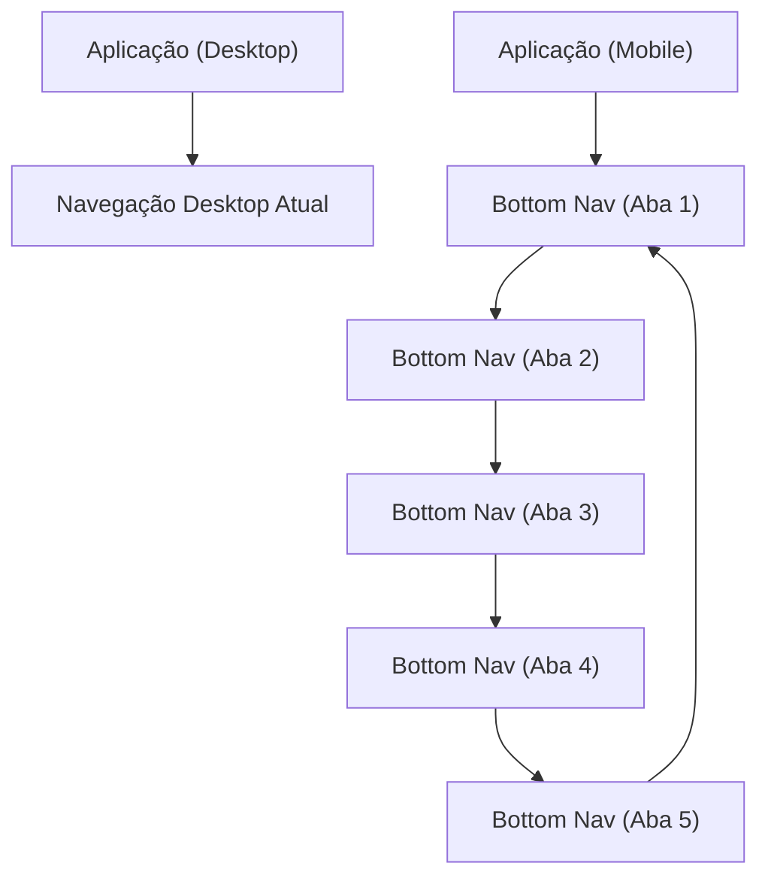

## 1. Product Overview
Refatoração de UX mobile para eliminar scroll horizontal e padronizar navegação por **bottom navigation fixa (5 abas)**.
Mantém compatibilidade com desktop e **não altera backend** (somente UI/Frontend).

## 2. Core Features

### 2.1 User Roles
Não há distinção de papéis nesta refatoração; a mudança é puramente de navegação e layout.

### 2.2 Feature Module
A refatoração consiste nas seguintes páginas essenciais:
1. **Aplicação (Layout Responsivo)**: contêiner responsivo, prevenção de overflow horizontal, áreas de conteúdo existentes.
2. **Navegação (Bottom Navigation – 5 abas)**: barra fixa no mobile, alternância entre abas, estado ativo, suporte a deep link.

### 2.3 Page Details
| Page Name | Module Name | Feature description |
|-----------|-------------|---------------------|
| Aplicação (Layout Responsivo) | Contêiner e grid | Garantir layout fluido sem overflow-x; respeitar safe areas; manter largura máxima no desktop e comportamento responsivo no mobile. |
| Aplicação (Layout Responsivo) | Conteúdo existente | Renderizar as telas/áreas atuais sem mudanças funcionais; apenas ajustar espaçamentos e quebras para mobile. |
| Navegação (Bottom Navigation – 5 abas) | Barra fixa | Fixar no rodapé apenas em viewport mobile; destacar aba ativa; suportar toque; manter acessibilidade (aria-label, foco). |
| Navegação (Bottom Navigation – 5 abas) | Mapeamento de abas | Exibir 5 abas (nomes/ícones definidos pelo produto); alternar conteúdo/rota sem recarregar a página; manter histórico/navegação do navegador. |
| Navegação (Bottom Navigation – 5 abas) | Compatibilidade desktop | Ocultar bottom nav no desktop; manter navegação desktop atual (top/side nav), sem regressões. |

## 3. Core Process
**Fluxo (Mobile)**
1. Você abre a aplicação no celular.
2. O conteúdo carrega com scroll apenas vertical (sem “puxar” horizontal).
3. Você alterna entre as 5 abas pela bottom navigation fixa, que mantém o item ativo destacado.
4. O conteúdo muda mantendo o contexto de navegação (voltar/avançar do browser funciona).

**Fluxo (Desktop)**
1. Você abre a aplicação no desktop.
2. A bottom navigation não aparece; a navegação permanece como já é hoje.
3. O layout respeita largura máxima e não cria barras horizontais.

